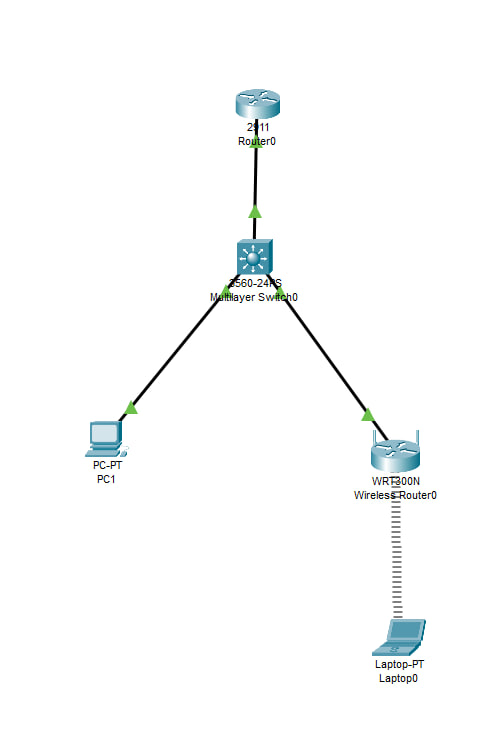

# VLAN-NAT-DHCP-Guest-WiFi-Lab

Practical networking lab demonstrating **VLAN segmentation, inter-VLAN routing (Router-on-a-Stick), DHCP configuration, NAT, and traffic isolation using ACLs**.

This lab simulates a small business network with two separated segments: a **cashier network** and a **guest Wi-Fi network**. Both networks have Internet access while remaining isolated from each other for security reasons.

All configurations were implemented and tested in **Cisco Packet Tracer**.

## Technologies

- VLAN segmentation (802.1Q)
- Inter-VLAN routing (Router-on-a-Stick)
- DHCP server configuration
- NAT (PAT overload)
- Extended Access Control Lists (ACL)
- Wireless access point configuration
- IPv4 addressing

## Lab Topology

### Small Business Network with Guest Wi-Fi

The topology includes:

- Router performing **inter-VLAN routing and NAT**
- Layer 2 switch with **VLAN segmentation**
- **Cashier workstation** with static IP
- **Guest Wi-Fi network** using DHCP
- Wireless access point connected to the guest VLAN
- Simulated Internet connection

## Implementation Highlights

- Created **VLAN 10 (Cashier)** and **VLAN 20 (Guests)** on the switch
- Configured **802.1Q trunk** between router and switch
- Implemented **Router-on-a-Stick** using router subinterfaces
- Configured **DHCP server** on the router for guest devices
- Implemented **NAT overload (PAT)** for Internet access
- Applied **extended ACL** to isolate VLAN 10 and VLAN 20
- Configured **WRT300N access point in AP mode**
- Enabled **WPA2-secured guest Wi-Fi network**

## Network Behavior

- Cashier PC uses **static IP configuration**
- Guest laptop receives an IP address via **DHCP**
- Both networks have **Internet access through NAT**
- **Communication between VLAN 10 and VLAN 20 is blocked**

## Verification

Network functionality was verified using Cisco IOS commands:

- Interface and VLAN status verification
- DHCP address assignment checks
- NAT translation table inspection
- ACL testing
- Connectivity tests using ICMP (ping)

Expected results:

- Devices in both VLANs can reach their **default gateway**
- Both networks have **Internet connectivity**
- **Ping between cashier and guest networks fails**, confirming VLAN isolation
- Guest devices successfully receive IP addresses from the **DHCP pool**
